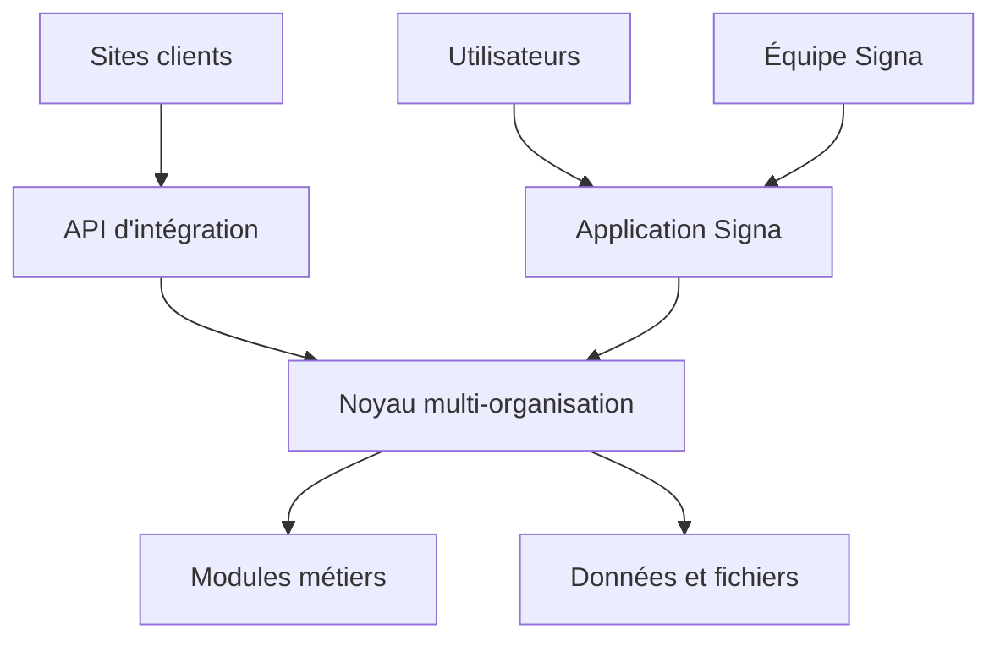

# Architecture de la plateforme

> Note (2026-09-12) : ce document décrit l'intention d'origine (Next.js/Cloudflare/Drizzle, DEC-009). L'implémentation réelle a divergé — voir `docs/14-DECISIONS.md` et `memory/memory.md` pour la stack effective (Vite/React, Supabase, pm2/nginx). Les domaines et règles de dépendance ci-dessous restent valides.

## Vue logique



## Domaines

| Domaine | Responsabilité | Exemples |
| --- | --- | --- |
| Identité | Connexion et sessions | utilisateur, session, invitation |
| Organisations | Appartenance et rôles | organisation, membre, rôle |
| Portail | Livraison du service Signa | projet, étape, fichier, correction |
| Noyau | Objets partagés | contact, activité, tâche, notification |
| Modules | Fonctions métier | CRM, rendez-vous, appel de service |
| Facturation | Forfait et droits | abonnement, produit, droit d'accès |
| Intégrations | Entrées et sorties | site, clé, soumission, webhook |
| Administration | Opérations Signa | soutien, suspension, audit |

## Règles de dépendance

- L'interface appelle des services ou routes serveur typés.
- Les services obtiennent l'organisation autorisée depuis la session.
- Les modules utilisent les contrats du noyau et ne lisent pas directement les tables d'un autre module.
- La facturation accorde des droits; elle ne contrôle pas seulement l'affichage.
- Les intégrations publiques passent par validation, limitation et idempotence.
- Les fournisseurs externes restent derrière des adaptateurs remplaçables.

## Structure cible (d'origine — voir note en tête de document)

```text
app/                  routes, mises en page et API
components/           composants visuels partagés
domains/core/         organisations, contacts et activités
domains/portal/       projet web et collaboration client
domains/modules/      modules métiers isolés
domains/admin/        opérations internes Signa
domains/billing/      forfaits, droits et Stripe
domains/integrations/ sites, clés, formulaires et webhooks
db/                   schéma et accès aux données
docs/                 documentation produit et technique
memory/               continuité du projet
```

## Requête authentifiée

1. Le serveur établit l'identité.
2. Il charge la relation de membre active.
3. Il détermine l'organisation et le rôle autorisés.
4. Il vérifie le droit d'accès au module.
5. Il valide la commande.
6. Il lit ou écrit avec `organizationId` imposé par le serveur.
7. Il inscrit les opérations sensibles au journal d'audit.

Implémenté via Supabase Row Level Security (chaque table porte `organization_id`, les policies vérifient l'appartenance active) plutôt qu'une couche applicative serveur explicite — le principe reste identique.

## Événements

Les effets secondaires utilisent des événements internes simples : `lead.received`, `project.approved`, `module.activated`, `subscription.updated`. Leur traitement est répétable et observable.
